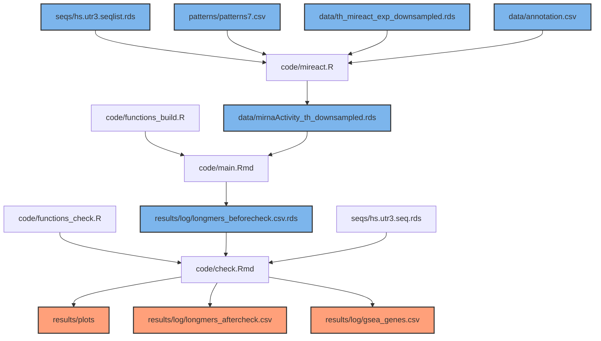

# longermer
This code takes miReact output (short kmers) as input and constructs longer motifs with potential biological relevance

To run miReact follow the instructions at https://github.com/muhligs/miReact. To access the publicly available data access Ren et al. (2021). COVID-19 immune features revealed by a large-scale single-cell transcriptome atlas. Cell. https://doi.org/10.1016/j.cell.2021.01.053.

## Overview of the workflow

## Results example
Results were obtained after working with a subset dataset formed by 10,000 cells, of which 3,085 were infected. 11 different cell types were studied. This is an example of potential results after running the analysis (longermer/results/log/longmers_aftercheck.csv):

| Final longmer | Initial longmer | Cell type |
| :---         |     :---:      |          ---: |
| ATTA(C\|G)(A\|G)G(A\|G)TTAC   | GGGATTACAGGT    | Neutrophil    |
| AACC(C\|T)TATGA     | AACCCTATGAAT       | Squamous     |
| TTCACCATGTT     | TTCACCATGTT       | T, B cell, Macrophage     |
| AATGTGGCA    | GAATGTGGCA       | Macrophage     |

Further plots can be created with this code (longermer/results/log):

Spearman correlation distribution of the modified p-values from miReact for top 100 kmers used for the analysis vs random 100 kmers from the distribution:

 

Logo of the final longmer after alignment to the whole set of sequences, including 10 flanking bases to both sides of the longmer:

