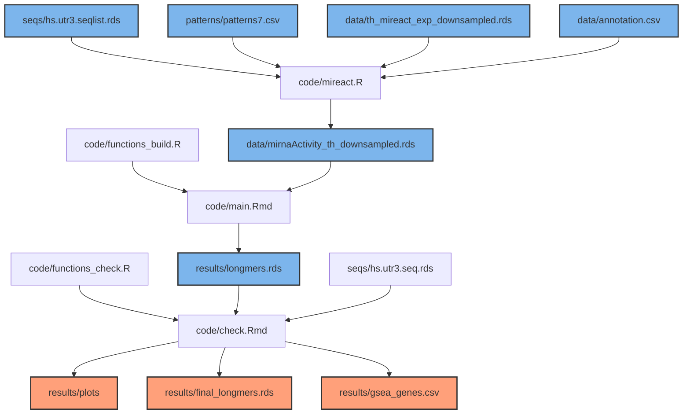

# longermer
This code takes miReact output (short kmers) as input and constructs longer motifs with biological relevance

```mermaid
graph TD;
    seqlist[seqs/hs.utr3.seqlist.rds]
    seqs[seqs/hs.utr3.seq.rds]
    mireact_input[data/th_mireact_exp_downsampled.rds]
    miReact_output[data/mirnaActivity_th_downsampled.rds]
    7mers[patterns/patterns7.csv]
    annotation[data/annotation.csv]
    miReact[code/mireact.R]
    functions[code/functions_build.R]
    functionsc[code/functions_check.R]
    main_notebook[code/main.Rmd]
    check_notebook[code/check.Rmd]
    GSEA[results/gsea_genes.csv]
    plots[results/plots]
    longmers[results/longmers.rds]
    finallongmers[results/final_longmers.rds]
    

    style seqlist fill:#7cb5ec,stroke:#333,stroke-width:2px;
    style miReact_output fill:#7cb5ec,stroke:#333,stroke-width:2px;
    style 7mers fill:#7cb5ec,stroke:#333,stroke-width:2px;
    style mireact_input fill:#7cb5ec,stroke:#333,stroke-width:2px;
    %%style seqs fill:#7cb5ec,stroke:#333,stroke-width:2px;
    style annotation fill:#7cb5ec,stroke:#333,stroke-width:2px;
    style longmers fill:#7cb5ec,stroke:#333,stroke-width:2px;
    style finallongmers fill:#FFA07A,stroke:#333,stroke-width:2px;
    style plots fill:#FFA07A,stroke:#333,stroke-width:2px;
    style GSEA fill:#FFA07A,stroke:#333,stroke-width:2px;


    seqlist-->miReact
    7mers-->miReact
    mireact_input-->miReact
    annotation-->miReact
    miReact-->miReact_output
    functions-->main_notebook
    functionsc-->check_notebook
    main_notebook-->longmers
    longmers-->check_notebook
    check_notebook-->plots
    check_notebook-->finallongmers
    check_notebook-->GSEA
    %%finallongmers-->GSEA
    %%seqs-->GSEA
    miReact_output-->main_notebook
    seqs --> check_notebook

```
